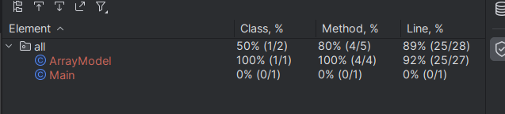

Объяснение:

Для тестирования используются 4 юнит-теста и 1 интеграционный: 

    Unit-test:
1) sizeInputTest - используется для тестирования метода который принимает число в консоль и возвращает его, как размер массива
2) arraySaveTest - проверяет корректную работу метода по сохранению массива из консоли, также проверят некорректное значение(не int)
3) averageNumOfArrayTest - проверяет  нахождение среднего значения в массиве
4) comparisonAvgTest - проверяет сравнение двух чисел и корректное отображение этого

    Интеграционный тест:
integrationArrayModelTest - проверяет полный цикл работы класса  ArrayModel

    